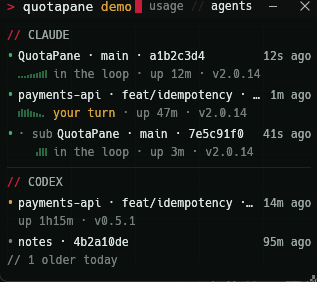
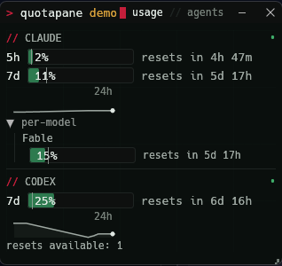
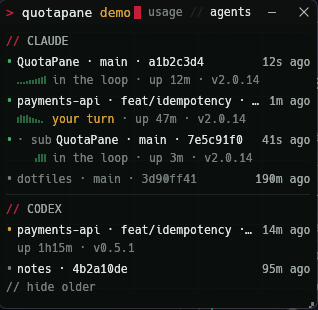

<p>
  <a href="https://github.com/cipherpine/quotapane/actions/workflows/ci.yml"></a>
  <a href="https://github.com/cipherpine/quotapane/releases/latest"></a>
  <a href="https://github.com/cipherpine/quotapane/releases"></a>
  <a href="https://github.com/cipherpine/quotapane#license"></a>
</p>

A small, always-on-top desktop window that shows how much of your **Claude** and **Codex** subscription quota you have left — read locally, from your own credentials, with no account to create and nothing phoned home.

The entire value proposition is a **small, auditable trust boundary**. Credentials and the network are owned by two modules — `crates/usage-core/src/credentials/` and `crates/usage-core/src/egress/` — deliberately small enough to read end to end in one sitting; the two provider parsers consume what they return. Everything else is scheduling and rendering.

<p align="center">
  
</p>

## What it shows

- **Claude (Anthropic)** — your 5-hour and 7-day subscription windows: percent used, and how long until each resets.
- **Codex (OpenAI)** — the rate-limit windows the Codex endpoint reports, labelled by their duration (typically a short rolling window plus a weekly one).
- **Per-model breakdown** — where a provider reports per-model limits, each provider pane has a collapsible toggle that expands them into their own rows.
- **Pace** — elapsed-time markers on every bar, and a burn-rate forecast that speaks up only when the current spend rate would exhaust a window *before* it resets.
- **Sparklines (opt-in)** — with `history=on`, a quiet 24-hour strip under each provider's bars: the day's shape at a glance.
- **Alerts (opt-in)** — with `alerts=on`, a banner, a red ring on the tray icon, and one taskbar attention request when a window crosses your line. Time-aware by default: a healthy 85% late in the week stays quiet.
- **Freshness** — a dot on each provider header ages green → amber → red as the data does; the exact seconds are on hover. You are never quietly shown a stale number.
- **System tray** — an icon rendering current usage, with a tooltip and a Show/Hide/Quit menu (Windows and macOS; see [Platform support](#platform-support)).
- **Headless mode** — `quotapane-cli` prints the same normalized snapshot as text or JSON, for scripts, for cron, and for proving to yourself what the app talks to. (Text output is a compact summary; per-model rows and reset credits appear in `--json` and the window.)
- **A gate for scripted runs** — `--fail-at <N>` exits non-zero when a quota window reaches N percent, and `--watch <SECS>` polls on an interval, so a long agentic or batch run can stop *before* it dies mid-flight. QuotaPane runs no commands of its own: it reports, your script decides.
- **An agents view** — `usage // agents` in the titlebar switches the pane to the Claude Code and Codex CLI sessions running on this machine (see below).

Two binaries are produced: `quotapane` (the window) and `quotapane-cli` (headless).

## Theming and preferences

The window ships with the Cipher Pine terminal theme. A tray-menu
item switches between it and a plain look, live; the choice is
remembered in `config.cfg` under your platform's config directory
(`%APPDATA%\quotapane\` on Windows, `~/.config/quotapane/` on
Linux). No tray on your platform? Launch with `--plain` or
`--themed` to pick per run.

`config.cfg` is one `key=value` per line — `#` comments and blank
lines are ignored, unknown keys are ignored, and anything unparsable
falls back to the default shown here. Deleting the file restores
every default.

| Key | Values | Default | Meaning |
|---|---|---|---|
| `theme` | `cipherpine` \| `plain` | `cipherpine` | Which look the window wears. |
| `history` | `on` \| `off` | `off` | Append usage percentages to `history.jsonl` (next to this file) and draw a 24 h sparkline under each provider's bars. Timestamps, window labels and percentages only — never credentials. |
| `alerts` | `on` \| `off` | `off` | Raise a quota alert: an in-window banner, a red ring on the tray icon, and one taskbar attention request. |
| `alert_at` | `1`–`100` | `80` | Percent of a window at which an alert becomes a candidate. |
| `alert_mode` | `pace` \| `threshold` | `pace` | `pace` only alerts when the window is *also* being spent faster than it is elapsing; `threshold` alerts on every crossing. |
| `update_check` | `on` \| `off` | *absent* | Whether the window may ask GitHub for the latest release tag, once per launch. **Absent is not `off` — it means un-asked**, and it is the only key here with three states: while it is absent the usage pane shows one footer line asking, and your answer is written here. Absent and `off` both send nothing. `on` makes one anonymous request — no credential, no version string, no identifier beyond a static `User-Agent` — and a newer release becomes one faint line of text. Delete the line to be asked again. |

Pre-1.6 installs stored the theme as a single word in `theme.cfg`.
That file is still read when `config.cfg` is absent, so your theme
carries over; it is never written again, and never deleted.

`--pace-demo` renders a fixed made-up scenario so the pace markers can
be seen without waiting hours for real usage to produce one: it shows
fake data, polls nothing, reads no credentials, and talks to no host.

## Agents view

The titlebar carries a switcher: `usage // agents`. Click `agents` and
the pane lists the Claude Code and Codex CLI sessions running on this
machine — a state dot (green working, amber idle, faint finished),
`project · branch · id8`, and how long since each last wrote. A row
marked `· sub` is a subagent. The pane opens on the last **two hours**,
with anything older one click away behind a `// N older today` line, so
a morning's finished sessions do not crowd out the one running now. A
session that is still going carries a second line: a ten-minute activity
strip, how long it has been up, the CLI version, and — for Claude Code,
whose transcript says so — whether it is `in the loop` or it is `your
turn`.

**Identity only, never content.** The list comes from the session-log
files those CLIs already write (`~/.claude/projects/`,
`~/.codex/sessions/`), opened read-only, and QuotaPane extracts a fixed
allowlist of metadata keys from them: ids, timestamps, record types, the
working directory, the git branch, and the CLI's own version string. The
second line above is made of the same stuff — the activity strip counts
timestamps, and the turn phrase reads a record's *type* and stops. Your
conversations are never
deserialized, never rendered, never stored, and never sent anywhere —
that is [`SECURITY.md`](SECURITY.md) invariant 8, and a test plants
sentinel text in a fixture transcript and asserts it cannot reach any
output. Liveness is inferred from file modification times, so a log
QuotaPane cannot parse still reports honestly instead of disappearing.

The scan runs **only while the agents view is showing** — on switch, then
every two seconds. Leave the window on `usage` and no session log is
read at all. Nothing is written, and nothing about these sessions leaves
your machine. `--agents-demo` opens the view on a synthetic session list,
touching no real log, for anyone who wants to see the feature before
pointing it at their own work.

<p align="center">
  
</p>

<p align="center">
  
  
</p>

## Security posture (the short version)

- Tokens are never persisted, never logged, never serialized. They live in memory in a `Secret<T>` that zeroizes on drop and prints `«redacted»`.
- Network egress is deny-by-default through a single chokepoint with a compile-time allowlist of exactly **three hosts**: the two providers (`api.anthropic.com`, `chatgpt.com`), plus `api.github.com`, reachable only through the opt-in, notify-only update check. Anything else is a hard error, and tests prove it.
- No first-party telemetry, of any kind, to anyone. CI enforces its absence on every push.
- **No auto-update** — there is no updater in the codebase at all: nothing is ever downloaded or executed, and updating is always something you do deliberately. The update *check* is opt-in and notify-only: the window asks once, in one footer line, and sends nothing until you say yes (or you run `quotapane-cli --check-update` yourself). It is one anonymous request for the latest release tag — no credential, no version string, no identifier — and a newer one is one faint line of text.
- Credential files are opened read-only. Token refresh is delegated to the official `claude` / `codex` CLIs; QuotaPane never writes them.
- Proxy support is opt-in and fails closed: with a proxy variable set and no opt-in, nothing is sent. Opting in is a per-run CLI flag behind an explicit warning that a TLS-inspecting proxy can observe your bearer token; the window has no opt-in at all.

Every claim above is a numbered invariant in `SECURITY.md`, and the mapping from each invariant to the live tests that prove it is **machine-checked in CI on every push** (`invariants.manifest` + `tools/check-invariants.py`, a required check). These are not promises in prose — the docs cannot silently drift from the code.

Full detail: [`SECURITY.md`](SECURITY.md) · [`THREAT_MODEL.md`](THREAT_MODEL.md) · [`ARCHITECTURE.md`](ARCHITECTURE.md).

## Install

Download the archive for your platform from [GitHub Releases](https://github.com/cipherpine/quotapane/releases), then verify it (below) before running it.

| Platform | Artifact |
|---|---|
| Windows (x86-64) | `quotapane-v<version>-x86_64-pc-windows-msvc.zip` |
| Linux (x86-64, glibc) | `quotapane-v<version>-x86_64-unknown-linux-gnu.tar.gz` |
| macOS | Build from source — see below. |

Each archive contains both binaries, both licenses, this README, and a `TOOLCHAIN.txt` recording the exact `rustc` / `cargo` that built it. There is no installer and nothing to uninstall: the binaries are self-contained. QuotaPane writes at most two files, both under your config directory: `config.cfg` (your preferences) and, only if you turn `history=on`, `history.jsonl` (timestamps, window labels and percentages — see Theming and preferences). Credentials are never written.

QuotaPane reads credentials your provider CLI already wrote, so sign in with `claude` and/or `codex` first.

## Verify a release

Release artifacts are built only by [`.github/workflows/release.yml`](.github/workflows/release.yml) on a version tag, never on a maintainer's machine. Every release ships `SHA256SUMS` covering all archives, a `cosign` keyless signature over that file as a Sigstore bundle (`SHA256SUMS.sigstore.json`, which carries both the signature and the signing certificate), and a build-provenance attestation on each archive. Verifying all three takes about a minute.

<!-- Maintainers: these three commands were run verbatim against the v1.0.0-rc.2 draft release and this section was corrected from that transcript (2026-07-28). Re-confirm against a real rc whenever the signing tooling changes — the transcript is the authority, not this text. -->

**1. Checksum.** Put the archive next to `SHA256SUMS`, then:

```sh
sha256sum --ignore-missing -c SHA256SUMS
```

On Windows PowerShell, compare manually against the matching line in `SHA256SUMS`:

```powershell
Get-FileHash quotapane-v<version>-x86_64-pc-windows-msvc.zip -Algorithm SHA256
```

**2. Signature.** `SHA256SUMS` is signed with [cosign](https://github.com/sigstore/cosign) keyless signing, so the identity is this repo's release workflow rather than a long-lived key:

```sh
cosign verify-blob SHA256SUMS \
  --bundle SHA256SUMS.sigstore.json \
  --certificate-identity-regexp '^https://github\.com/cipherpine/quotapane/\.github/workflows/release\.yml@refs/tags/' \
  --certificate-oidc-issuer https://token.actions.githubusercontent.com
```

This prints `Verified OK`. The identity regex is deliberately narrow: it matches only this repository's `release.yml` running on a tag ref, so a signature produced by any other workflow, or by this one on a branch, fails.

You need a cosign that understands Sigstore bundles — confirmed with cosign 3.1.2 against a bundle produced by cosign 3.0.6 in CI. Releases no longer ship the detached `SHA256SUMS.sig` / `SHA256SUMS.pem` pair that cosign 2.x used.

On Windows, run this from PowerShell or WSL rather than Git Bash. Git Bash rewrites the `\.` escapes in the identity regex before cosign sees them and the match fails; if you must use Git Bash, write `[.]` in place of each `\.`.

**3. Provenance.** Each archive carries a GitHub build-provenance attestation, verifiable with the `gh` CLI:

```sh
gh attestation verify quotapane-v<version>-x86_64-pc-windows-msvc.zip --repo cipherpine/quotapane
```

A passing signature proves the artifact came from this repository's CI at a specific commit. It does **not** prove that commit was benign — see residual risk R2 in [`THREAT_MODEL.md`](THREAT_MODEL.md). For maximum assurance, build from source.

## Building from source

```sh
cargo build --release --locked
cargo test --workspace --locked   # includes the security invariant tests
```

Requires **Rust 1.92+** (the workspace sets `rust-version = "1.92"`; the floor comes from `eframe` 0.35). Binaries land in `target/release/` as `quotapane` and `quotapane-cli`.

## Usage

The window takes no arguments in normal use. Drag it to position it; drag the grip at the bottom edge to choose its height, or double-click the grip to snap the window to exactly fit its content. The height is remembered.

```
quotapane [--client-version <VER>] [--codex-user-agent <UA>] [--no-tray]
```

| Flag | Meaning |
|---|---|
| `--client-version <VER>` | The `claude-code` version string sent as the Claude `User-Agent`. Defaults to `0.0.0`, which the endpoint throttles aggressively — pass a real version for normal use. |
| `--codex-user-agent <UA>` | Override the `User-Agent` sent to the Codex endpoint. Defaults to the Codex CLI's own. |
| `--no-tray` | Start without the system tray icon. The escape hatch if tray creation fails. |

The headless CLI takes exactly one mode: `--once`, `--watch <SECS>`, `--statusline`, or `--check-update`.

```
quotapane-cli (--once | --watch <SECS>) [--json]
              [--provider claude|codex|all] [--fail-at <N>]
              [--client-version <VER>] [--debug-raw] [--debug-raw-unsafe]
quotapane-cli --statusline
quotapane-cli --check-update
```

| Flag | Meaning |
|---|---|
| `--once` | Poll once and exit. Exactly one of `--once` and `--watch` is required. |
| `--watch <SECS>` | Poll every `SECS` seconds until interrupted. `SECS` must be at least **180** — the same polling floor the window respects, applied to scripted polling too. Text output precedes each cycle with a `--- <RFC 3339 UTC timestamp> ---` separator; with `--json`, each cycle is one compact line (NDJSON). |
| `--statusline` | Read one [Claude Code statusline](https://docs.claude.com/en/docs/claude-code/statusline) JSON document from stdin, print one line of quota, and exit 0 — e.g. `5h 12% · 7d 83%! · resets 2h10m`. **The only mode that sends nothing:** Claude Code already hands its statusline command the quota numbers, so QuotaPane opens no credential file, builds no HTTP client, and makes no request. Combines with no other flag, `--client-version` included: there is no request for a version string to ride on. A payload with no `rate_limits` in it prints nothing and still exits 0 — a status line must never break its host. The line is for humans and is **not** covered by the `--json` stability contract. Setup, and the cases where the payload carries no quota at all: [`docs/gating.md`](docs/gating.md#5-claude-codes-own-status-line). |
| `--check-update` | Ask GitHub for the latest release tag, print one line, and exit — `quotapane 1.7.0 — v1.8.0 available: github.com/cipherpine/quotapane/releases`, or `quotapane 1.7.0 — up to date`. Running the command **is** the opt-in, so the window's `update_check` preference is not consulted. One anonymous request carrying no credential, no version string, and no identifier beyond a static `User-Agent`; exactly one field of the response is read. Exits 0 either way, and **1** with `update check failed` if the check could not complete — it will not tell you why, because nothing here records why. Combines with no other flag. |
| `--fail-at <N>` | Exit **3** if any window is at or over `N` percent used (`N` is 1–100), after printing the normal output. Checked over every window of every provider that polled successfully — headline **and** per-model, because a gate should fail safe. Under `--watch`, the first tripping cycle exits. |
| `--json` | Emit the normalized snapshot as JSON instead of a text summary. With `--provider all`, emits an array. The keys are documented in [`docs/cli-json.md`](docs/cli-json.md), which also states the stability policy. |
| `--provider <WHICH>` | `claude`, `codex`, or `all`. Default: `claude`. |
| `--client-version <VER>` | As above. |
| `--debug-raw` | Print the provider's wire response instead of a snapshot, for pinning an undocumented endpoint's schema. Takes precedence over `--json`. **Redacted by default:** the value of every `email`, `user_id`, `account_id`, and `id` key is replaced with `«redacted»` at any nesting depth, and a body that is not valid JSON is withheld rather than dumped. |
| `--debug-raw-unsafe` | The same dump, byte-exact — no redaction, no withholding — after a stderr warning. The output can contain your email address and account identifiers, so treat it as private. Implies `--debug-raw`. |
| `--allow-proxy` | Send this run through the proxy in your environment. Off by default, and the default **fails closed**: while `HTTPS_PROXY`/`HTTP_PROXY`/`ALL_PROXY` (either casing) is set and this flag is absent, QuotaPane sends nothing and exits with an error naming the variable — it does not connect directly instead. A TLS-inspecting proxy can read your bearer token, so opting in is explicit and lasts one run. The window has no equivalent flag. |
| `-h`, `--help` / `--version` | Print help or version and exit. |

Exit codes — what a script branches on:

| Code | Meaning |
|---|---|
| `0` | Success; with `--fail-at`, all windows under the threshold. |
| `1` | A provider or credential error. |
| `2` | Usage error. |
| `3` | `--fail-at` tripped: a window reached the threshold. |

So the gate in front of a long run is one line:

```sh
quotapane-cli --once --provider all --fail-at 85 || exit 1
```

QuotaPane never executes anything on your behalf — `--fail-at` reports, and your script decides.

**Gating** — that one-liner explained, plus a CI stage that refuses to start under quota pressure, a background NDJSON heartbeat, a `pre-push` hook that warns without blocking, and the Claude Code status line setup: [`docs/gating.md`](docs/gating.md).

If a token has expired, QuotaPane says so and tells you to run `claude` or `codex` — it never refreshes tokens itself.

## Platform support

Windows is the primary target. macOS and Linux are built and tested in CI on a best-effort basis.

The system tray is **Windows and macOS only**. On Linux, QuotaPane is window-only: the tray backend would require the officially-unmaintained gtk-rs 0.18 + libappindicator chain, which is not a dependency this project is willing to put in its tree. See the `tray-icon` row in [`CONTRIBUTING.md`](CONTRIBUTING.md) for the full analysis.

## Roadmap

**v1.0 shipped July 2026**: both subscription providers, the always-on-top window, the system tray, the per-model breakdown, and the headless CLI — packaged as signed, attested releases. Since then: per-model truth from the endpoint's own limits array (v1.1), the Cipher Pine theme and the live tray miniature (v1.2), pace markers and forecast-to-limit (v1.3), a full adversarial security review and its remediations (v1.4), CLI automation — `--fail-at` and `--watch` (v1.5), opt-in history, sparklines and time-aware alerts (v1.6), and the resizable window plus the agents view (v1.7).

**M4 (opt-in official billing APIs) was withdrawn** on security grounds (ADR-002, in [`ARCHITECTURE.md`](ARCHITECTURE.md)). Both vendors' usage/cost endpoints require an organization **admin** API key, are unavailable to individual subscribers, measure a different thing than subscription quota, and would force this trust boundary to hold the highest-blast-radius secret in either ecosystem — the exact opposite of the point of this project.

Since v1.7: `quotapane-cli --statusline`, which feeds Claude Code's own status bar without making a single request, and WinGet manifests. The update check landed on exactly the terms `SECURITY.md` invariant 5 pre-committed to — notify-only, off by default, and unable to carry a credential — which is also what brought `api.github.com` back to the egress allowlist, together with its one caller and not before.

Next: the remaining package-manager targets (Homebrew / AUR). Still deferred: the token-free `OtelSource` (the only acceptable route to any cost view).

## FAQ

### Why does it say my token expired?

QuotaPane has no login of its own — it reads the credential files the
official `claude` / `codex` CLIs keep on your machine, and it never
writes them. When the stored token's lifetime runs out, QuotaPane fails
closed: it stops sending the stale token and shows the message instead.

The refresh happens in the provider's CLI, not in QuotaPane:

- **Claude** — start any `claude` session (even `claude -p hi`). The
  CLI refreshes its token file as it starts working.
- **Codex** — run `codex login`.

That's all. QuotaPane rechecks every 3 minutes while a token is
expired and recovers on its own — no restart, no clicks.

## Disclaimer

QuotaPane is an independent, community project — **not affiliated with, endorsed, or supported by Anthropic or OpenAI.** The subscription/quota view relies on **undocumented endpoints that may change or break at any time**, uses **your own local credentials only**, bypasses no authentication, and scrapes nothing. To read subscription usage, QuotaPane sends the same `User-Agent: claude-code/<version>` header the official Claude Code client uses — the endpoint rate-limits requests without it — so these requests **present as the official client**; the Codex provider likewise sends the Codex CLI's default `User-Agent` (`codex-cli`). Each provider queries only the endpoint its official client already calls, with your own token, read-only. Use at your own risk.

## Contributing

See [`CONTRIBUTING.md`](CONTRIBUTING.md). Security issues go through GitHub private vulnerability reporting, **not** a public issue — see [`SECURITY.md`](SECURITY.md).

## License

Dual-licensed under [MIT](LICENSE-MIT) or [Apache-2.0](LICENSE-APACHE), at your option. Contributions are accepted under the same terms.
