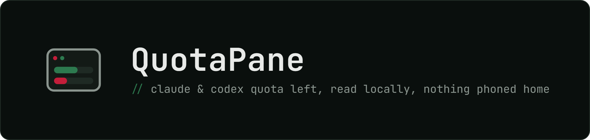
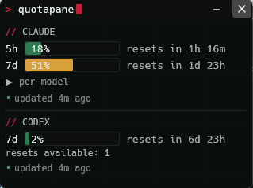
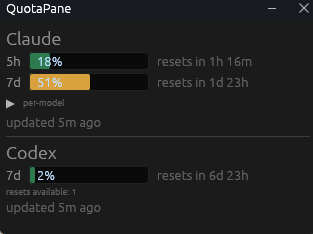
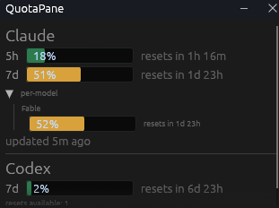

<p>
  <a href="https://github.com/cipherpine/quotapane/actions/workflows/ci.yml"></a>
  <a href="https://github.com/cipherpine/quotapane/releases/latest"></a>
  <a href="https://github.com/cipherpine/quotapane/releases"></a>
  <a href="https://github.com/cipherpine/quotapane#license"></a>
</p>

A small, always-on-top desktop window that shows how much of your **Claude** and **Codex** subscription quota you have left — read locally, from your own credentials, with no account to create and nothing phoned home.

The entire value proposition is a **small, auditable trust boundary**. Only two modules ever touch a credential or the network — `crates/usage-core/src/credentials/` and `crates/usage-core/src/egress/` — and they are deliberately small enough to read end to end in one sitting. Everything else is scheduling and rendering.

<p align="center">
  
</p>

## What it shows

- **Claude (Anthropic)** — your 5-hour and 7-day subscription windows: percent used, and how long until each resets.
- **Codex (OpenAI)** — the rate-limit windows the Codex endpoint reports, labelled by their duration (typically a short rolling window plus a weekly one).
- **Per-model breakdown** — where a provider reports per-model limits, each provider pane has a collapsible toggle that expands them into their own rows.
- **Staleness** — the window tells you when the data is older than it should be, rather than quietly showing you a stale number.
- **System tray** — an icon rendering current usage, with a tooltip and a Show/Hide/Quit menu (Windows and macOS; see [Platform support](#platform-support)).
- **Headless mode** — `quotapane-cli` prints the same normalized snapshot as text or JSON, for scripts, for cron, and for proving to yourself what the app talks to.

Two binaries are produced: `quotapane` (the window) and `quotapane-cli` (headless).

## Theming

The window ships with the Cipher Pine terminal theme. A tray-menu
item switches between it and a plain look, live; the choice is
remembered as a single word (`plain` or `cipherpine`) in
`theme.cfg` under your platform's config directory
(`%APPDATA%\quotapane\` on Windows, `~/.config/quotapane/` on
Linux). No tray on your platform? Launch with `--plain` or
`--themed` to pick per run. The file stores nothing but that word;
deleting it restores the default.

<p align="center">
  
  
</p>

## Security posture (the short version)

- Tokens are never persisted, never logged, never serialized. They live in memory in a `Secret<T>` that zeroizes on drop and prints `«redacted»`.
- Network egress is deny-by-default through a single chokepoint with a compile-time allowlist of exactly **two hosts** (`api.anthropic.com`, `chatgpt.com`). Anything else is a hard error, and tests prove it.
- No first-party telemetry, of any kind, to anyone. CI enforces its absence on every push.
- **No auto-update and no update check** — there is no updater in the codebase at all. Updating is always something you do deliberately.
- Credential files are opened read-only. Token refresh is delegated to the official `claude` / `codex` CLIs; QuotaPane never writes them.
- Proxy support is opt-in, behind an explicit warning that a TLS-inspecting proxy can observe your bearer token.

Full detail: [`SECURITY.md`](SECURITY.md) · [`THREAT_MODEL.md`](THREAT_MODEL.md) · [`ARCHITECTURE.md`](ARCHITECTURE.md).

## Install

Download the archive for your platform from [GitHub Releases](https://github.com/cipherpine/quotapane/releases), then verify it (below) before running it.

| Platform | Artifact |
|---|---|
| Windows (x86-64) | `quotapane-v<version>-x86_64-pc-windows-msvc.zip` |
| Linux (x86-64, glibc) | `quotapane-v<version>-x86_64-unknown-linux-gnu.tar.gz` |
| macOS | Build from source — see below. |

Each archive contains both binaries, both licenses, this README, and a `TOOLCHAIN.txt` recording the exact `rustc` / `cargo` that built it. There is no installer and nothing to uninstall: the binaries are self-contained, and QuotaPane writes no files.

QuotaPane reads credentials your provider CLI already wrote, so sign in with `claude` and/or `codex` first.

## Verify a release

Release artifacts are built only by [`.github/workflows/release.yml`](.github/workflows/release.yml) on a version tag, never on a maintainer's machine. Every release ships `SHA256SUMS` covering all archives, a `cosign` keyless signature over that file as a Sigstore bundle (`SHA256SUMS.sigstore.json`, which carries both the signature and the signing certificate), and a build-provenance attestation on each archive. Verifying all three takes about a minute.

<!-- Maintainers: these three commands were run verbatim against the v1.0.0-rc.2 draft release and this section was corrected from that transcript (2026-07-28). Re-confirm against a real rc whenever the signing tooling changes — the transcript is the authority, not this text. -->

**1. Checksum.** Put the archive next to `SHA256SUMS`, then:

```sh
sha256sum --ignore-missing -c SHA256SUMS
```

On Windows PowerShell, compare manually against the matching line in `SHA256SUMS`:

```powershell
Get-FileHash quotapane-v<version>-x86_64-pc-windows-msvc.zip -Algorithm SHA256
```

**2. Signature.** `SHA256SUMS` is signed with [cosign](https://github.com/sigstore/cosign) keyless signing, so the identity is this repo's release workflow rather than a long-lived key:

```sh
cosign verify-blob SHA256SUMS \
  --bundle SHA256SUMS.sigstore.json \
  --certificate-identity-regexp '^https://github\.com/cipherpine/quotapane/\.github/workflows/release\.yml@refs/tags/' \
  --certificate-oidc-issuer https://token.actions.githubusercontent.com
```

This prints `Verified OK`. The identity regex is deliberately narrow: it matches only this repository's `release.yml` running on a tag ref, so a signature produced by any other workflow, or by this one on a branch, fails.

You need a cosign that understands Sigstore bundles — confirmed with cosign 3.1.2 against a bundle produced by cosign 3.0.6 in CI. Releases no longer ship the detached `SHA256SUMS.sig` / `SHA256SUMS.pem` pair that cosign 2.x used.

On Windows, run this from PowerShell or WSL rather than Git Bash. Git Bash rewrites the `\.` escapes in the identity regex before cosign sees them and the match fails; if you must use Git Bash, write `[.]` in place of each `\.`.

**3. Provenance.** Each archive carries a GitHub build-provenance attestation, verifiable with the `gh` CLI:

```sh
gh attestation verify quotapane-v<version>-x86_64-pc-windows-msvc.zip --repo cipherpine/quotapane
```

A passing signature proves the artifact came from this repository's CI at a specific commit. It does **not** prove that commit was benign — see residual risk R2 in [`THREAT_MODEL.md`](THREAT_MODEL.md). For maximum assurance, build from source.

## Building from source

```sh
cargo build --release --locked
cargo test --workspace --locked   # includes the security invariant tests
```

Requires **Rust 1.92+** (the workspace sets `rust-version = "1.92"`; the floor comes from `eframe` 0.35). Binaries land in `target/release/` as `quotapane` and `quotapane-cli`.

## Usage

The window takes no arguments in normal use; drag it to position it, and scroll if the content is taller than the window.

```
quotapane [--client-version <VER>] [--codex-user-agent <UA>] [--no-tray]
```

| Flag | Meaning |
|---|---|
| `--client-version <VER>` | The `claude-code` version string sent as the Claude `User-Agent`. Defaults to `0.0.0`, which the endpoint throttles aggressively — pass a real version for normal use. |
| `--codex-user-agent <UA>` | Override the `User-Agent` sent to the Codex endpoint. Defaults to the Codex CLI's own. |
| `--no-tray` | Start without the system tray icon. The escape hatch if tray creation fails. |

The headless CLI requires `--once`; one-shot polling is its only mode today.

```
quotapane-cli --once [--json] [--provider claude|codex|all]
              [--client-version <VER>] [--debug-raw]
```

| Flag | Meaning |
|---|---|
| `--once` | Poll once and exit. **Required.** |
| `--json` | Emit the normalized snapshot as JSON instead of a text summary. With `--provider all`, emits an array. |
| `--provider <WHICH>` | `claude`, `codex`, or `all`. Default: `claude`. |
| `--client-version <VER>` | As above. |
| `--debug-raw` | Print the provider's exact wire response instead of a snapshot, for pinning an undocumented endpoint's schema. Takes precedence over `--json`. |
| `-h`, `--help` / `--version` | Print help or version and exit. |

If a token has expired, QuotaPane says so and tells you to run `claude` or `codex` — it never refreshes tokens itself.

## Platform support

Windows is the primary target. macOS and Linux are built and tested in CI on a best-effort basis.

The system tray is **Windows and macOS only**. On Linux, QuotaPane is window-only: the tray backend would require the officially-unmaintained gtk-rs 0.18 + libappindicator chain, which is not a dependency this project is willing to put in its tree. See the `tray-icon` row in [`CONTRIBUTING.md`](CONTRIBUTING.md) for the full analysis.

## Roadmap

**v1.0 is the current scope**: both subscription providers, the always-on-top window, the system tray, the per-model breakdown, and the headless CLI — packaged as signed, attested releases.

**M4 (opt-in official billing APIs) was withdrawn** on security grounds (ADR-002, in [`ARCHITECTURE.md`](ARCHITECTURE.md)). Both vendors' usage/cost endpoints require an organization **admin** API key, are unavailable to individual subscribers, measure a different thing than subscription quota, and would force this trust boundary to hold the highest-blast-radius secret in either ecosystem — the exact opposite of the point of this project.

Deferred to after 1.0: usage history and sparklines, forecast-to-limit, configurable thresholds and alerts, an optional token-free `OtelSource` (the only acceptable route to any cost view), and package-manager distribution (WinGet / Homebrew / AUR).

## Disclaimer

QuotaPane is an independent, community project — **not affiliated with, endorsed, or supported by Anthropic or OpenAI.** The subscription/quota view relies on **undocumented endpoints that may change or break at any time**, uses **your own local credentials only**, bypasses no authentication, and scrapes nothing. To read subscription usage, QuotaPane sends the same `User-Agent: claude-code/<version>` header the official Claude Code client uses — the endpoint rate-limits requests without it — so these requests **present as the official client**; the Codex provider likewise sends the Codex CLI's default `User-Agent` (`codex-cli`). Each provider queries only the endpoint its official client already calls, with your own token, read-only. Use at your own risk.

## Contributing

See [`CONTRIBUTING.md`](CONTRIBUTING.md). Security issues go through GitHub private vulnerability reporting, **not** a public issue — see [`SECURITY.md`](SECURITY.md).

## License

Dual-licensed under [MIT](LICENSE-MIT) or [Apache-2.0](LICENSE-APACHE), at your option. Contributions are accepted under the same terms.
